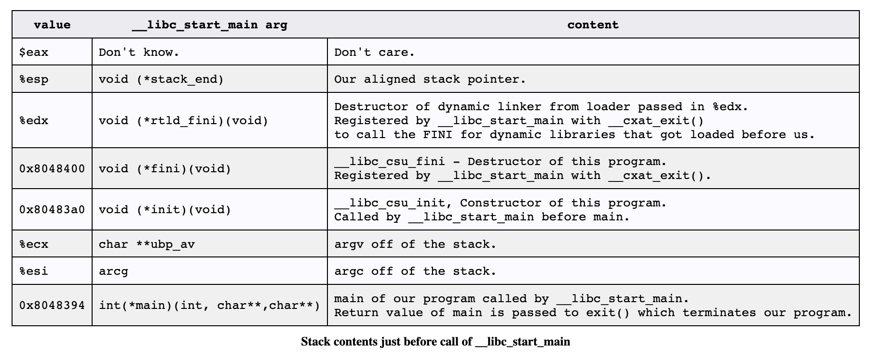

# Learning program startup
Resource -> http://dbp-consulting.com/tutorials/debugging/linuxProgramStartup.html


## Objdump command
```bash
objdump -D prog1 > prog1.dump
```

## How did we get to main ?
First thing that's run is a function linked to every program name `_start` which eventually leads to program's `main()` being run.

## How do we get to _start ?
When i run a program, the shell or gui calls `execve()` which executes the linux syscall `execve()`.
Then the kernel is going to set a brand new stack for the new program (initialization).

This is acording to System V ABI:

High addresses

```text
┌──────────────────────────────┐
│   environment strings        │  ← actual "PATH=/usr/bin\0" etc.
├──────────────────────────────┤
│   argument strings           │  ← actual "ls\0", "-l\0" etc.
├──────────────────────────────┤
│   auxiliary vector (auxv)    │  ← kernel info: page size, entry point, etc.
├──────────────────────────────┤
│   NULL                       │
│   envp[n]... envp[0]         │  ← pointers to env strings
├──────────────────────────────┤
│   NULL                       │
│   argv[argc-1]... argv[0]    │  ← pointers to arg strings
├──────────────────────────────┤
│   argc                       │  ← stack pointer (RSP) starts here
└──────────────────────────────┘
```

This enable and explains how `main()` can receive its arguments:
```c
int main(int argc, char *argv[], char *envp[]) {                                                                                                                                              
    // argc, argv, envp are read from the stack the kernel set up                                                                                                                             
}
```

The C runtime (_start → __libc_start_main) just reads them off the stack and passes them to main().         

What else execve() sets up besides the stack                                                                                                                                                          
  - Text segment — new program's code loaded from the ELF file                                                                                                                                  
  - Data + BSS segments — initialized globals + zeroed globals
  - Heap — fresh, empty (program break reset)                                                                                                                                                   
  - Stack — new, with argv/envp/auxv as shown above                                                                                                                                             
  - Registers — reset; instruction pointer set to the program's entry point (_start)                                                                                                            
  - Signal handlers — reset to default       

Then comes the loader that is doing much work for me by setting realocations. When everything is ready, control is handed to my program by calling `_start()`.

## Set up for calling `__libc_start_main`
Now we start pushing arguments for `__libc_start_main` onto the stack. 

In the source fo glibc, it is specified like:
```c
int __libc_start_main(  int (*main) (int, char * *, char * *),
			    int argc, char * * ubp_av,
			    void (*init) (void),
			    void (*fini) (void),
			    void (*rtld_fini) (void),
			    void (* stack_end));
```
So we expect `_start` to push those arguments on the stack in reverse order before the call to `__libc_start_main`.

   

