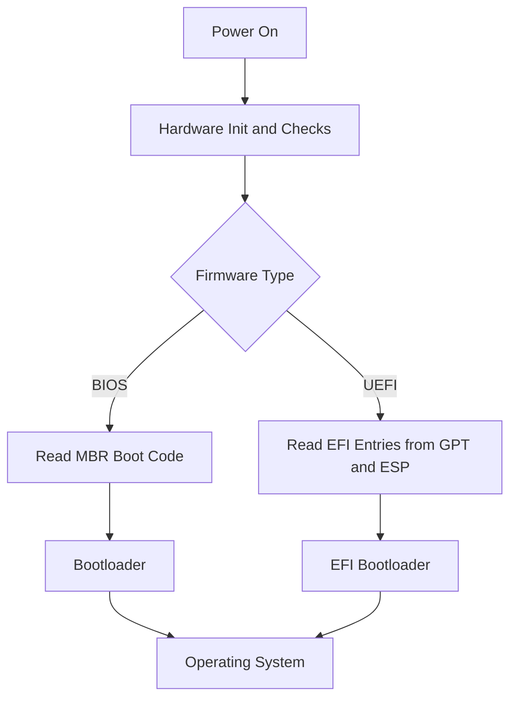
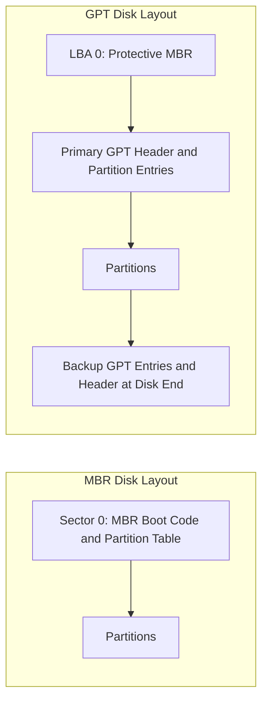
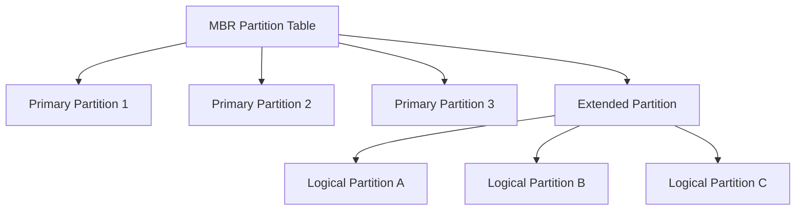

# Boot and Disk Partitioning Fundamentals

Quick Refresher [here](https://www.youtube.com/watch?v=XpFsMB6FoOs)

## Bios
Bios is something that starts working immediately after i click the power button on my computer. Basically it initializes all the hardware and checks for errors. After that the bios gives the control to the OS. The bios is something that is attached as a memory chip to the motherboard, so it acts like a firmware.

### When i start the computers this is what it happens:

1. BIOS initializes all the hardware devices.
2. Then it search and find the bootloader program, from the `Boot Priority List` and executes it

    - Such program is stored in an external storage device like (SSD, USB or hard disk).
    - This bootloader program is responsible to start the OS, example for bootloader - Windows Boot Manager, GRUB(linux)
    - With BIOS this program is on the `MBR` partition

- BIOS is an older approach, for example it supports only up to 14 partitions and a max partition size of 2 TB, which in today world is not practical for more powerfull workloads.

## UEFI
This is like the BIOS but it is a more modern way, it supports up to 128 partitions and a max size of 18 EB (Exobytes).

- It uses `GPT` to store partition information and the bootloader program

## MBR
A classical way to store bootloader program and partition information.

- it reserves the first 512 bytes on the hardDisk/SSD storage.
- It is used only by bios-based systems
- MBR is non redundant -> it doesnt replicate the records it contains, that means if corrupt system will not boot.

## GPT
Modern way to store bootloader and partition information.

- reserves 4KB from the disk after 512 bytes from the SSD.
- Both BIOS and UEFI-based systems can use it.
- GPT is redundant -> It saves a copy of the partition information at the end of the disk

## Visual Overview

### 1) Boot Flow: BIOS vs UEFI

### 2) Disk Metadata Layout: MBR vs GPT

### 3) Partition Types in MBR: Primary, Extended, Logical

